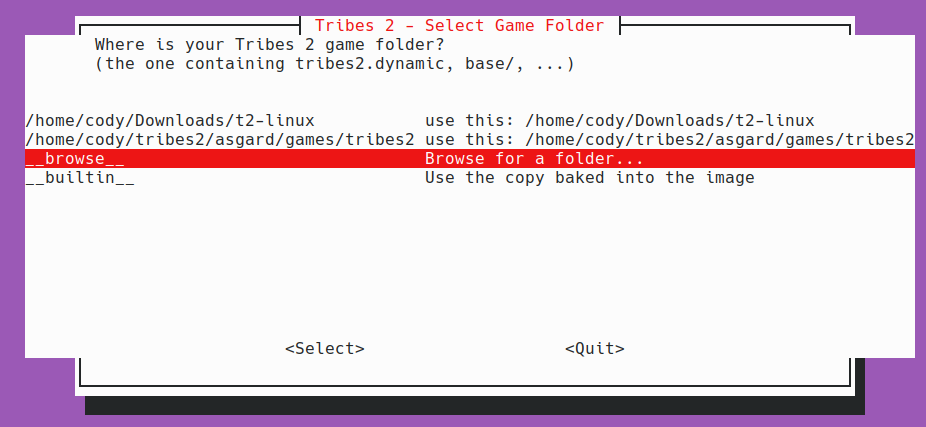
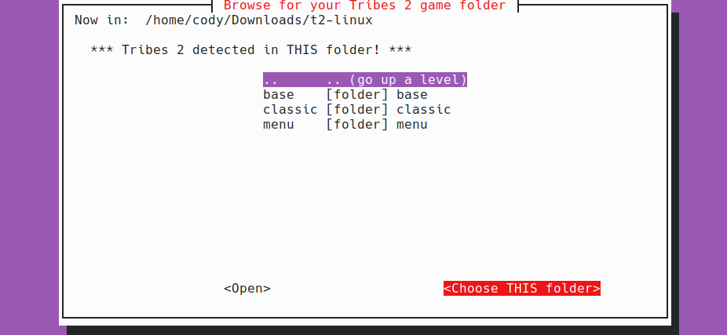

# Tribes 2 Docker Compatibility Layer

A Docker-based compatibility wrapper to run the native 2001 Loki Software Linux port of **Tribes 2** on modern 64-bit (x86_64) Linux hosts (such as Ubuntu 24.04, KDE neon, Debian, and Arch).

It solves modern system issues (NPTL threading conflicts, OSS/ALSA audio locks, OpenGL driver issues, and display socket routing) by containerizing the game in a 32-bit Ubuntu 16.04 container.

---

## Technical Features & Workarounds Included

1. **Threading Model Compatibility (NPTL vs LinuxThreads):**
   The native game binary freezes or deadlocks under modern host kernels due to NPTL. Running the engine inside a 32-bit Ubuntu 16.04 container isolates it under a compatible threading context.
2. **TrueType Font Fallbacks (Bypasses Exit Code 1):**
   The GUI profile manager requires `Arial.ttf` and `Verdana Bold.ttf` to start up the main menu shell. If these are missing, the client exits cleanly with status `1`. This repository bundles open-source Liberation Sans fonts renamed as drop-in replacements for Arial/Verdana.
3. **Intro Movie Handling (situational):**
   Passing the `-nologin` flag bypasses defunct WON/Sierra login servers but makes the game load the intro movie. On most complete game copies the intro plays (or is skipped by the engine) without issue. However, if `base/textures/T2IntroC15.mpg` is missing on your copy, the smpeg engine can null-dereference and segfault (`BUG! Going down hard...`). If that happens, set `$pref::SkipIntro = 1;` in `ClientPrefs.cs` — see Troubleshooting below.
4. **Audio Routing via PulseAudio OSS wrapper:**
   PulseAudio OSS emulation (`padsp`) is wrapped around the execution launcher to route OSS `/dev/dsp` calls through modern audio endpoints.
5. **Software OpenGL Rendering:**
   Forced software Mesa OpenGL rendering (`LIBGL_ALWAYS_SOFTWARE=1`) is enabled by default to prevent hardware driver symbol mismatches inside the legacy 32-bit container.

---

## Quick Start

**The only thing you need to do is point it at your Tribes 2 game folder.**
Everything else — building the Docker image, bundling the compatibility
libraries and fonts, launching the game — happens automatically.

**Prerequisite:** [Docker](https://docs.docker.com/engine/install/) installed and
runnable by your user.

```bash
git clone https://github.com/CodeMasterCody3D/tribes-2-docker.git
cd tribes-2-docker
./asgard-run
```

That's it. An arrow-key menu appears so you can tell it where your Tribes 2 game
folder is (the folder containing `tribes2.dynamic`, `base/`, etc.).

**1. Pick a detected install, or browse.** The first screen lists any
auto-detected game folders. Use **↑/↓** to highlight one and press **Enter** on
**`<Select>`**. If yours isn't listed, choose **"Browse for a folder..."**.
(**"Use the copy baked into the image"** runs game files bundled into the image
instead — see Advanced.)



**2. Browse to your folder and choose it.** The browser shows the folder you're
currently in at the top, with its sub-folders listed below:

- **↑/↓** highlight a sub-folder, then press **Enter** on **`<Open>`** to go
  inside it.
- Highlight **".. (go up a level)"** and **`<Open>`** to go back up.
- When you're in the right place (it shows **`*** Tribes 2 detected in THIS
  folder! ***`**), press **Tab** to move to **`<Choose THIS folder>`** and hit
  **Enter** to select it.



On the **first run** it builds the Docker image automatically (a one-time step
that takes a few minutes). After that, `./asgard-run` launches straight into the
folder menu and plays.

Your game folder is never modified: it's bind-mounted into the container, and the
launcher (`run_t2.sh`) and replacement fonts (`base/fonts/`) are layered on top
automatically. It can live anywhere on your disk.

> The menu uses `whiptail` (preinstalled on most Linux distros). Without it, or in
> a non-interactive shell, the scripts fall back to a simple text prompt.

### Advanced / optional

- **Skip the menu** by passing the path directly:
  ```bash
  ./asgard-run tribes2 /path/to/your/tribes2
  ```
- **Pass extra flags to the game** — put them after a `--`. They're forwarded
  straight to `tribes2.dynamic` (after the `-nologin` the launcher already adds),
  so you don't have to run the binary by hand:
  ```bash
  ./asgard-run tribes2 /path/to/your/tribes2 -- -window -mod classic
  ./asgard-run -- -dedicated          # game + folder still auto-picked/prompted
  ```
  Or use the `GAME_ARGS` environment variable instead of `--`:
  ```bash
  GAME_ARGS="-window -mod classic" ./asgard-run
  ```
- **Bake the game into the image** instead of bind-mounting: copy your game files
  into `games/tribes2/` before the first run. Then `./asgard-run` with no folder
  works offline from the image.
- **Rebuild the image manually:** `./asgard-build tribes2`.
- **Refresh the bundled compat libraries:** `./bundle-libs.sh` (interactive). The
  libraries ship with the repo already, so you normally never need this — it's a
  maintainer tool for swapping in a different set of `.so` files.

---

## Troubleshooting

**Nothing happens — the menu finishes but the game never starts (no error):**
The container needs to reach your X server, which requires `xhost`. It's
preinstalled on Ubuntu/Debian but **not on Arch/CachyOS or Fedora**. Install it:
```bash
# Arch / CachyOS
sudo pacman -S --needed xorg-xhost libnewt
# Fedora
sudo dnf install xorg-x11-server-utils newt
```
(`libnewt`/`newt` also gives you the nice arrow-key menu instead of the text
fallback.) `asgard-run` now warns instead of silently aborting when `xhost` is
missing, and it works the same on **Wayland** (via XWayland) — you don't need an
X11 session.

**`docker: permission denied` or "Docker not usable":**
Make sure the daemon is running and your user is in the `docker` group:
```bash
sudo systemctl enable --now docker
sudo usermod -aG docker $USER   # then log out and back in
```

**Game segfaults on startup with `BUG! Going down hard...` (missing intro movie):**
If your game copy is missing `base/textures/T2IntroC15.mpg`, the intro player can crash. Skip the intro by adding the preference to your local config:
```bash
mkdir -p ~/.loki/tribes2/base/prefs/
echo '$pref::SkipIntro = 1;' >> ~/.loki/tribes2/base/prefs/ClientPrefs.cs
```
(Most complete game copies don't need this — the intro plays fine.)
